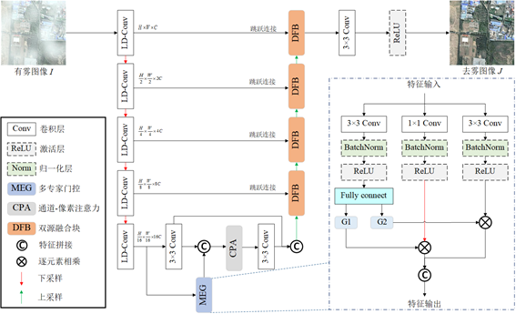
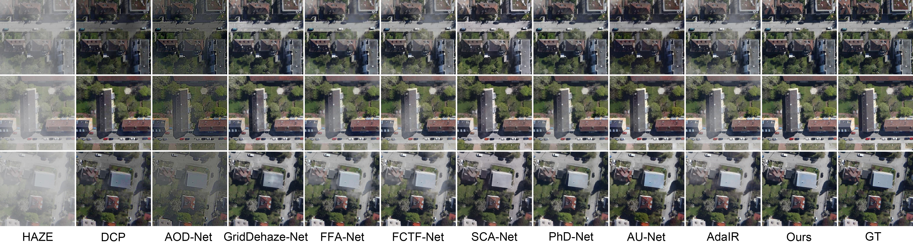

# Remote sensing image dehazing via a multi-expert dynamic gating network

---

## 🧠 Network Architecture

---

## 📊 Visualize the results

---

### 🚀 Getting Started

We train and test the code on **PyTorch 1.13.0 + CUDA 11.7**. The detailed configuration is mentioned in the paper.

## 📦 Available Resources

Here are the download links for the model checkpoint:
- 🔹 **SateHaze1k**  
[📥 Download](https://pan.baidu.com/s/1qBtbIWmPinu99wgmvL6lTA?pwd=2ef2)
- 🔹 **HRSD**  
[📥 Download](https://pan.baidu.com/s/1qBtbIWmPinu99wgmvL6lTA?pwd=2ef2)
- 🔹 **RRSHID**  
[📥 Download](https://pan.baidu.com/s/1qBtbIWmPinu99wgmvL6lTA?pwd=2ef2)

---

## 📫 Contact
If you have any questions, please feel free to contact us:  
✉️ yuhang@ahut.edu.cn
